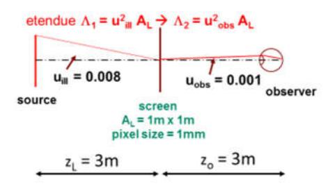

## Speckle Reduction I: There is no free lunch

Gerd Häusler\*, Florian Dötzer\*, Klaus Mantel\*\* *\*Institute of Optics, Information and Photonics, University of Erlangen-Nuremberg \*\*Max Planck Institute for the Science of Light, Erlangen*

## *mailto: gerd.haeusler@fau.de*

We will introduce options for instantaneous speckle reduction with laser illumination, exploiting the limited coherence length. The costs are that an optical system with low coherent noise has to allocate significantly more channel capacity than exploitable by the observer. We furthermore introduce a novel, simple method to measure the coherence length of a laser.

## 1 Coherence, Speckle and Information theory

Motivated by the upcoming technology of laser projection [1], we discuss methods for instantaneous speckle reduction and the theoretical and technical consequences of "incoherent laser illumination". Fast scanning of a modulated laser beam by a MEMS mirror enables small, lensless and low cost laser "beamers". The observed images, however, display speckle noise. Manufacturers already incorporate some (insufficient) speckle reduction by polarization averaging [2]. Other approved methods from the speckle reduction toolbox [3], [4], specifically moving diffusors, cannot be implemented, due to a pixel time of only 10 ns, which would require a diffusor speed of several hundred km/sec.

In section 2 we will discuss "instantaneous" speckle reduction with laser illumination. But first we have to discuss standard illumination with an incoherent source. Speckle is caused by spatial coherence, even with much temporal incoherence [3]. So reduction of spatial coherence is the key. Exploiting the van Cittert–Zernike theorem, we find that the speckle contrast C, respectively the signal-to-noise ratio SNR in the image of a diffusely reflecting object that is illuminated by an incoherent (!) source is given by

$$SNR = 1/C = \sin u_{ill} / \sin u_{obs}, \qquad (1)$$

where *sin uill* , *sin uobs* are the illumination- and observation aperture. To explain the consequences of Eq. (1) for any kind of projection, we consider a realistic projector geometry, as shown in Fig. 1.

*Fig. 1 Geometry of realistic projection with reduced spatial coherence / reduced speckle noise*

The chosen apertures allow for a best SNR~8, according to Eq. (1). The apertures together with the screen area AL comprise a chain of a large projection etendue 1=uill2AL and a small "observation etendue" 2=uobs2AL. In a chain of etendues, the smallest will limit the throughput of light. This is a first hint for increased "costs".

We introduce the etendue for one more reason, because is connected with information:

- (2) */ 2 = Space-Bandwidth Product SBP = #pixels*
- (3) *CC = Channel Capacity [bit] = SBP log2(1+SNR)*

The channel capacity is a measure for the maximum transmittable information, and at the same time a measure for the amount of technology that has to be allocated: channel capacity is expensive [5].

Figure 2 reveals that for the projection path we

|                  | Projection + diffusor | observ. (eye) |
|------------------|-----------------------|---------------|
| Aperture         | 24 mm                 | 3 mm          |
| SBP              | 64 Mpix               | 1 Mpix        |
| SNR              | 1                     | 8 ©           |
| Channel Capacity | 64 Mbit               | 3 Mbit 😣      |

*Fig. 2 Information loss vs SNR in the etendue chain*

have to allocate a channel capacity of 64 Mbit (per frame), although the observer can exploit only 3 Mbit. What happened is that we trade SBP (number of pixels) for better SNR (low speckle noise), paying the prize in terms of information efficiency.

Of course, illumination optics is commonly not diffraction limited. Nevertheless this is not esoteric reasoning, as there are serious practical consequences [6], [7]: The demanded illumination aperture of 24mm requires a large scanning mirror, which is not available for a required line frequency of 100 kHz. And of course, with a large projection aperture, the major advantages of laser projectors (small size, no lens, no depth of field problems) – are gone.

submitted: 14.Sep.2017 published: 15.Sep.2017